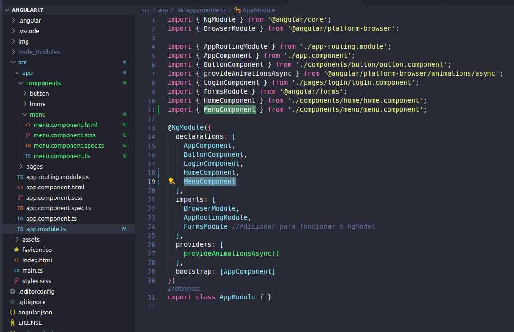
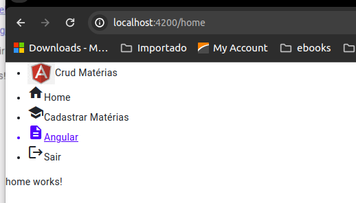
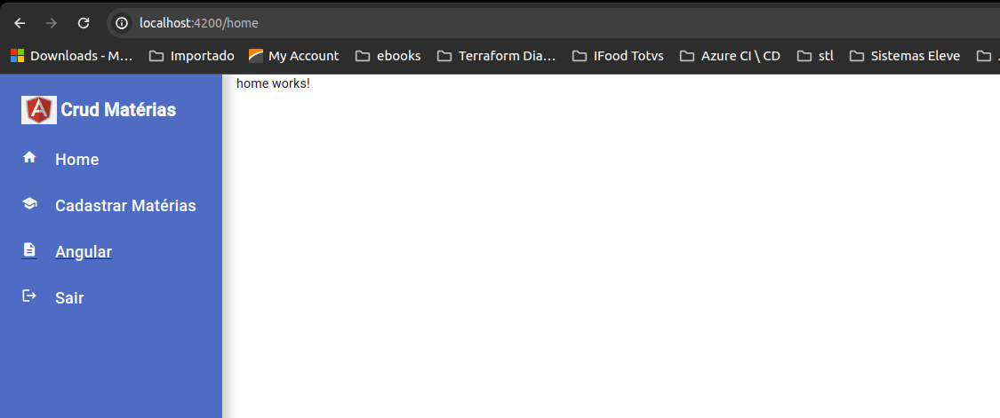

# Componente de Menu

Seguindo a forma que criamos nossos componentes, vamos criar agora nosso componente de menu, abaixo segue o comando:

>ng g c components/menu

Note que o componente ao ser criado, irá ter a pasta do menu dentro da pasta de components, assim como todos os arquivos e no app.modules.ts o mesmo estará importando, conforme podemos ver na imagem abaixo:



E vamos já chamar nosso componente de menu na home.component.html

```html
<app-menu></app-menu>


<p>home works!</p>
```

## Aplicando Style sobre o menu

Vamos começar importanto no nosso app.module.ts os icones do material, que é o MatIconModule, para isso é necessário fazer um import do @angular através da sintaxe:

>import { MatIconModule } from '@angular/material/icon';

nossa classe do app.module.ts fica dessa forma:

```javascript
import { NgModule } from '@angular/core';
import { BrowserModule } from '@angular/platform-browser';

import { AppRoutingModule } from './app-routing.module';
import { AppComponent } from './app.component';
import { ButtonComponent } from './components/button/button.component';
import { provideAnimationsAsync } from '@angular/platform-browser/animations/async';
import { LoginComponent } from './pages/login/login.component';
import { FormsModule } from '@angular/forms';
import { HomeComponent } from './components/home/home.component';
import { MenuComponent } from './components/menu/menu.component';
import { MatIconModule } from '@angular/material/icon';

@NgModule({
  declarations: [
    AppComponent,
    ButtonComponent,
    LoginComponent,
    HomeComponent,
    MenuComponent
  ],
  imports: [
    BrowserModule,
    AppRoutingModule,
    FormsModule,
    MatIconModule,
  ],
  providers: [
    provideAnimationsAsync()
  ],
  bootstrap: [AppComponent]
})
export class AppModule { }

```

Vamos criar nosso menu, porém vamos adicionar alguns ícones para dar uma aparência melhor para nosso menu, esses icones vamos utilizar através do angular material usando a tag `<mat-icon>`, as imagens que vamos usar nós podemos encontrar várias no site:

https://fonts.google.com/icons

Basta pesquisar o tema e ele irá mostrar várias opções relacionadas ao tema para sua escolha, vamos criar nosso menu com as seguintes informações:

```html
<nav class="sidemenu">
    <ul>
        <li>
            
            <span class="logo">Crud Matérias</span>
        </li>
        <li ><mat-icon>home</mat-icon>Home</li>
        <li ><mat-icon>school</mat-icon>Cadastrar Matérias</li>
        <a href="" target="_blank"><li><mat-icon>description</mat-icon>Angular</li></a>
        <li ><mat-icon>logout</mat-icon>Sair</li>
    </ul>
</nav>

```

Você pode ver que já aplicamos sobre os li do nosso html a propriedade `routerLink` que nos permitira fazer a chama para o route de acordo com o valor passado.



 Vamos melhorar a visualização, aplicando um estilo sobre nosso menu html:

```css
.sidemenu {
    width: 250px;
    height: 100vh;
    min-height: 100vh;
    display: block;
    float: left;
    background-color: var(--primary-color);
    padding: 10px 0px;
    box-shadow: 4px 0px 10px 4px #0a0a0a30;
    margin-right: 16px;

    ul { padding: 0;}

    .logo {
        font-size: 20px;
        font-weight: bold;
        margin-left: 4px;
    }

    li {
        font-size: 18px;
        font-weight: 500;
        color: #fafafa;
        padding: 14px 24px;
        display: flex;
        align-items: center;
        justify-content: left;
        transition: 0.3s linear all;
        
        mat-icon { margin-right: 14px; font-size: 18px; }
        &:hover {
            background: #e6e6e6;
            cursor: pointer;
            color: var(--primary-color);
        }
    }
}
```

Note que ele já começa a ter uma aparencia de menu



Vamos deixar o `Sair` no final da página e ajustar o tamanho dos icones, no final nosso menu terá essa estrutura:

```css
.sidemenu {
    width: 250px;
    height: 100vh;
    min-height: 100vh;
    display: block;
    float: left;
    background-color: var(--primary-color);
    padding: 10px 0px;
    box-shadow: 4px 0px 10px 4px #0a0a0a30;
    margin-right: 16px;

    ul { padding: 0;}

    .logo {
        font-size: 20px;
        font-weight: bold;
        margin-left: 4px;
    }

    li {
        font-size: 18px;
        font-weight: 500;
        color: #fafafa;
        padding: 14px 24px;
        display: flex;
        align-items: center;
        justify-content: left;
        transition: 0.3s linear all;
        
        mat-icon { margin-right: 14px; font-size: 22px; }
        &:hover {
            background: #e6e6e6;
            cursor: pointer;
            color: var(--primary-color);
        }
    }

    .logout {
        position: absolute;
        bottom: 0;
        width: 250px;
    }

    a { text-decoration: none; }
}
```


## Adicionando routerLink no Menu


```html
<nav class="sidemenu">
    <ul>
        <li>
            
            <span class="logo">Crud Matérias</span>
        </li>
        <li routerLink="/home"><mat-icon>home</mat-icon>Home</li>
        <li routerLink="/classes"><mat-icon>school</mat-icon>Cadastrar Matérias</li>
        <a href="" target="_blank"><li><mat-icon>description</mat-icon>Angular</li></a>
        <li routerLink="/login"><mat-icon>logout</mat-icon>Sair</li>
    </ul>
</nav>

```