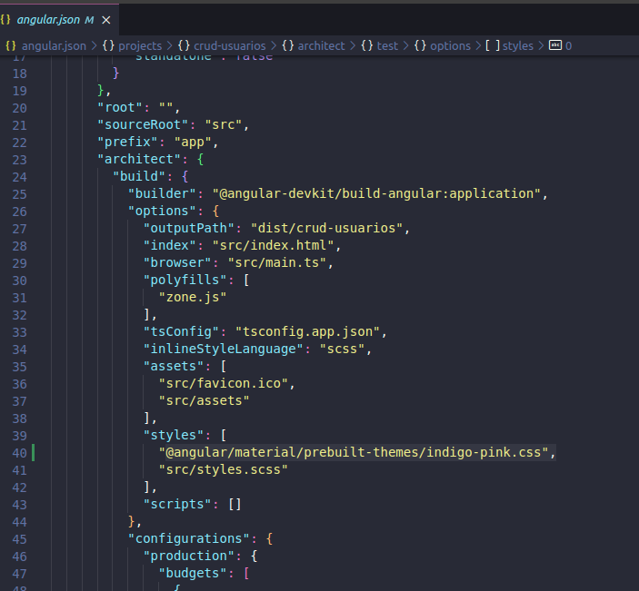
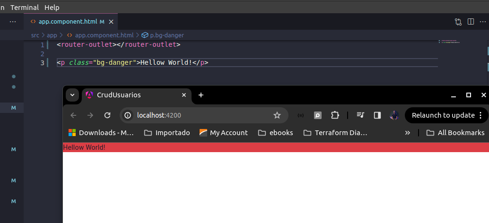
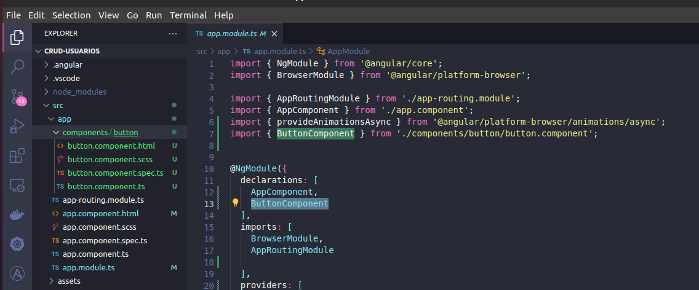
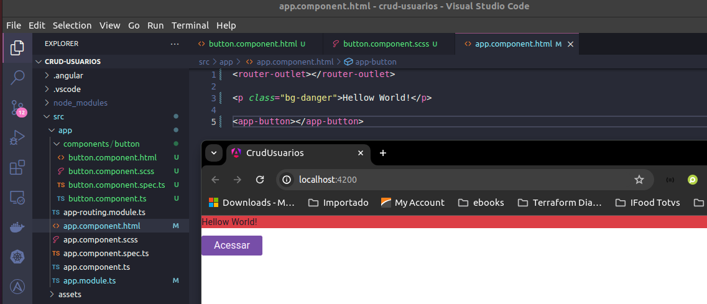
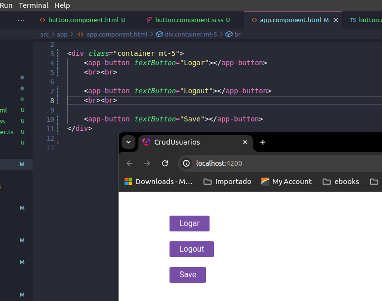
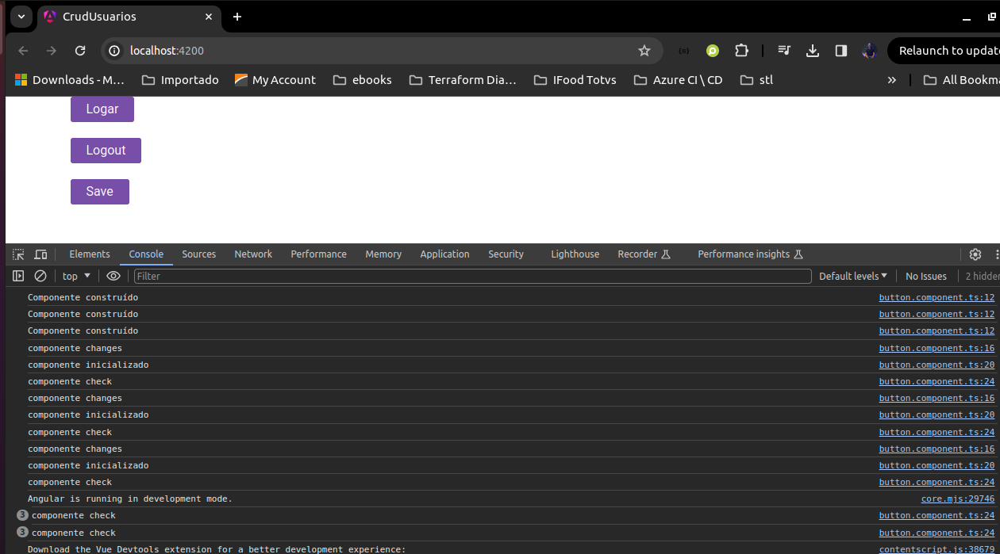
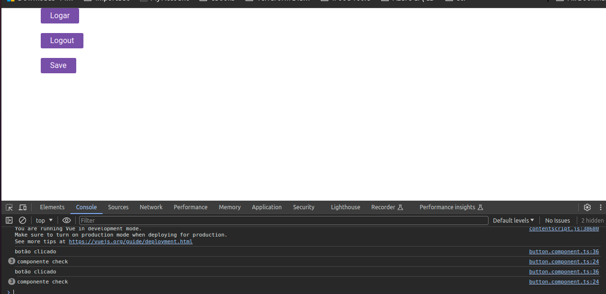

# Criando um projeto com Angular 17

Passo a passo default para instalar e criar um projeto com angular:

>- npm install -g @angular/cli
>- ng new my-app
>- cd my-app
>- ng serve

Na versão 17 ele não tem mais o app.module padrão, para criar um projeto na versão 17 mantendo o app.module deve-se usar o parametro --no-standalone:

## Componentes

Componentes podem ser grandes como na imagem, mas podem ser algo menor, como um botão.


### Criando um Componente

Para criar um component basta utilizar a cli passando o tipo como component e o nome do componente que deseja criar:


Exemplo:
- ng generate componet components/button

<i>Neste exemplo já está sendo informado a pasta onde será criado o componente</i>


## Criando nosso projeto

Para criar nosso projeto vamos rodar o comando abaixo:

> ng new crud-usuarios --no-standalone

Para validar se a aplicação está funcionando, na pasta raiz do projeto criado e rodar o comando:

> ng serve -o

<i>a flag -o irá fazer com que a saída já seja o navegador</i>


### Instalando o bootstrap

Você pode encontrar várias formas de obter o pacote através do site: [Site-boostrap](https://getbootstrap.com/docs/5.3/getting-started/download/)

Neste projeto vamos obter o Boostrap através do npm 

> npm install bootstrap@5.3.3

No styles.scss do projeto vamos adicionar o bootstrap de forma global com a linha a seguir:

> @import '../node_modules/bootstrap/dist/css/bootstrap.min.css';

### Instando o Angular Material

Angular Material é um framework visual com vários componentes prontos para serem utilizados e estilizados no projeto, você pode ver mais sobre o angular material no site: [Angular-Material](https://material.angular.io/)

Para instalar o Angular Material basta rodar no projeto o comando:

> ng add @angular/material

Ao final da instalação note que ele mudou alguns arquivos:

1 - styles.scss: Definiu as fontes do body

```scss
/* You can add global styles to this file, and also import other style files */

@import '../node_modules/bootstrap/dist/css/bootstrap.min.css';
html, body { height: 100%; }
body { margin: 0; font-family: Roboto, "Helvetica Neue", sans-serif; }
```

2 - package.json: Adicionou o boostrap e o @angular/material como dependência

3 - index.html: Adicionou a typografia e os links do Material-icon

```html
<!doctype html>
<html lang="en">
<head>
  <meta charset="utf-8">
  <title>CrudUsuarios</title>
  <base href="/">
  <meta name="viewport" content="width=device-width, initial-scale=1">
  <link rel="icon" type="image/x-icon" href="favicon.ico">
  <link href="https://fonts.googleapis.com/css2?family=Roboto:wght@300;400;500&display=swap" rel="stylesheet">
  <link href="https://fonts.googleapis.com/icon?family=Material+Icons" rel="stylesheet">
</head>
<body class="mat-typography">
  <app-root></app-root>
</body>
</html>
```

4 - angular.json: Adicionou no styles o tema escolhido do angular-material



### Realizando um teste com bootstrap

Na pagina index.html dentro do app criar um parágrafo com a class bg-danger



Outros tipos de background color podem ser encontrados no link [Background-color](https://getbootstrap.com/docs/5.3/utilities/background/#background-color)

### Criando nosso primeiro componente 

Vamos criar um componente através do comando

> ng generate component components/button

Ao final, note que tanto a pasta components/button foi criada já com os arquivos necessários do component assim como o app.module já foi injetado este novo componente



Vamos editar o html do componente adicionando a tag abaixo


Vamos estilizar esse botão editando o scss do mesmo

```scss
.botao-primario {
    width: auto; // deixa automático obedecendo o do tamanho do texto
    outline: none; // Outline é muito útil quando se quer remover o comportamento padrão do browser de adicionar uma borda a um elemento quando ele esta selecionado
    border: 0;
    background: #417ec0;
    color: #fff;
    font-weight: 400;
    font-size: 16px;
    padding: 6px 20px;
    border-radius: 3px;
    box-shadow: 0px 0ox 3px 1px #0a0a0a20; // sombra no botão
    transition: 0.3s linear all; 
    &:hover {
        cursor: pointer;
        box-shadow: 0px 0px 5px 3px #0a0a0a40;;
    }
    &:disabled {
        cursor: default;
        opacity: 0.7; 
    }
}
```

Visualizando nosso component, vamos adicionar no <b>app-component.html</b> nosso <b>button-component</b>




Vamos deixar esse button mais dinâmico, ficando mais próximo de um componente que pode ser reutilizavel

No arquivo butto.component.ts, vamos adicioinar uma variável textButton, como mostro a seguir

```javascript
import { Component, Input } from '@angular/core';

@Component({
  selector: 'app-button',
  templateUrl: './button.component.html',
  styleUrl: './button.component.scss'
})
export class ButtonComponent {
  @Input() textButton: string // @Input permite que nossa váriavel possa receber um valor de fora
}
```

No button.component.html, vamos criar um link a variável através do two way data binding:

```html
<button class="botao-primario">{{textButton}}</button>
```

Para fechar, vamos adicionar agora 3x o app-button dentro do app.component.html com valores diferentes

```html
<router-outlet></router-outlet>

<div class="container mt-5">
    <app-button textButton="Logar"></app-button>
    <br><br>

    <app-button textButton="Logout"></app-button>
    <br><br>

    <app-button textButton="Save"></app-button>
</div>
```

Tendo como resultado:


### Criando variáveis no scss global

```scss

/* You can add global styles to this file, and also import other style files */

@import '../node_modules/bootstrap/dist/css/bootstrap.min.css';
html, body { height: 100%; }
body { margin: 0; font-family: Roboto, "Helvetica Neue", sans-serif; }

//:root: Este é um seletor CSS que seleciona a raiz do documento. No caso de HTML, é o mesmo que selecionar o elemento html. As variáveis definidas aqui estão disponíveis globalmente em todo o CSS.
:root { 
    --primary-color: #7533a8;
    --error-color: #ac2828;
    --gray-color: #747474;
}


//.c-primary, .c-error, .c-gray: Estes são seletores de classe CSS. Eles selecionam elementos que têm a classe correspondente. Por exemplo, .c-primary seleciona todos os elementos que têm a classe c-primary.
.c-primary { color: var(--primary-color); }
.c-error { color: var(--error-color); }
.c-gray { color: var(--gray-color); }

.hover:hover{ cursor: pointer; }
```

### Lyfecycle Hooks

Vamos enteder o ciclo de vida dos componentes, uma linha do tempo desde o início ao fim

[Visão Geral do Ciclo de Vida Angular v2](https://v2.angular.io/docs/ts/latest/guide/lifecycle-hooks.html)


[Visão Geral do Ciclo de Vida Angular v17](https://angular.io/guide/lifecycle-hooks)

Cada mudança nesse ciclo é uma função nativa do angular e podemos utilizar para facilitar nosso desenvolvimento.

Normalmente não é utilizado todos os eventos, os mais comuns são:

- constructor
- ngOnInit
- ngOnDestroy

em alguns casos para monitorar uma váriavel é usado o 

- ngOnChanges

Vamos adicionar no nosso componente <b>button.component.ts</b> os eventos e realizar um log sempre que um evento for chamado


```javascript
import { Component, Input } from '@angular/core';

@Component({
  selector: 'app-button',
  templateUrl: './button.component.html',
  styleUrl: './button.component.scss'
})
export class ButtonComponent {
  @Input() textButton: string // @Input permite que nossa váriavel possa rececber um valor de fora

  constructor() {
    console.log('Componente construído');
  }

  ngOnChanges() {
    console.log('componente changes');
  }

  ngOnInit() {
    console.log('componente inicializado');
  }

  ngDoCheck() {
    console.log('componente check');
  }

  ngAfterViewIniit() {
    console.log('componente view inicializada');
  }

  ngOnDestroy() {
    console.log('destruido');
  }

}
```

Olhando o console.log na ferramenta do desenvolvedor do navegador



Vamos adicionar uma função chamada teste, logo após a função ngOnDestroy, que apenas faz um log sempre que for chamada


```javascript
teste() {
    console.log('botão clicado');
  }
```

E vamos alterar nosso html chamando essa função sempre que o button for clicado

```html
<button class="botao-primario" (click)="teste()">{{textButton}}</button>
```

Note que sempre que houver o click ele irá chamar tanto a função teste como a ngDoCheck



Então tome cuidado ao usar a função ngDoCheck, pois ela é pesada e sempre será acionada 

### Event Binding

É a vinculação de eventos que permite ouvir e resposnder as ações do usuário, como pressionamentos de teclas, movimentos do mouse, cliques e toques.

[Angular Event Bindings](https://angular.io/guide/event-binding)


[Lista de eventos Angular](https://edupala.com/angular-events-binding-and-angular-event-list/)


### Componente Login

No terminal, navegar até a pasta raiz do projeto em seguida rodar o comando

> ng g c pages/login

Este componente não será criado na pasta components pois se trata de uma tela especifica para o login, então vamos criar o mesmo na pasta pages

No arquivo app-routing.module.ts, vamos adicionar um path de login no Routes

```javascript

import { NgModule } from '@angular/core';
import { RouterModule, Routes } from '@angular/router';
import { LoginComponent } from './pages/login/login.component';

const routes: Routes = [
  { path: 'login', component: LoginComponent }
];

@NgModule({
  imports: [RouterModule.forRoot(routes)],
  exports: [RouterModule]
})

export class AppRoutingModule { }
```

Como queremos que ao entrar na aplicação (quando não é informado um path) ele acesse a tela de login, vamos adicionar também o path vazio redirecionando para o loginComponent

```javascript

import { NgModule } from '@angular/core';
import { RouterModule, Routes } from '@angular/router';
import { LoginComponent } from './pages/login/login.component';

const routes: Routes = [
  { path: '', component: LoginComponent},
  { path: 'login', component: LoginComponent }
];

@NgModule({
  imports: [RouterModule.forRoot(routes)],
  exports: [RouterModule]
})

export class AppRoutingModule { }
```